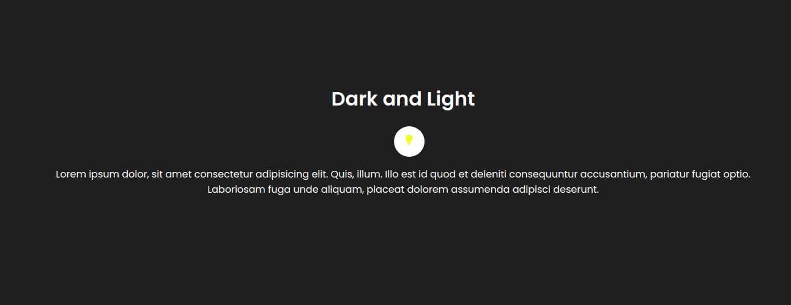

<h1 align="center">
  Dark Theme and Light Theme
</h1>

<h3 align="center">
    
     
</h3>

Aplicação simples com opção de tema escuro e tema claro.

**Instalação:** ``npm install``

**Execução:** ``npm start``

<h4 align="center">
    Made with 💜 by <a href="https://www.linkedin.com/in/carlos-daniel-17a320196/" target="_blank">Carlos Daniel</a>
</h4>
